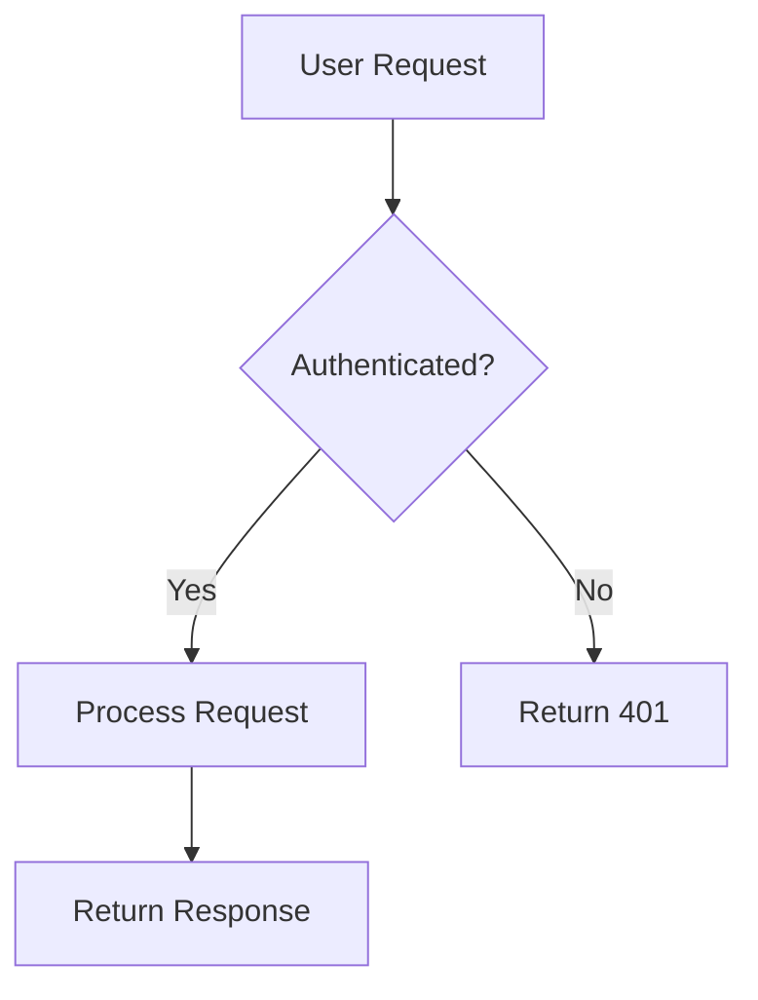

Visual content makes documentation more engaging and easier to understand. This guide shows you how to add images, videos, and other media to your Mintlify docs.

## Adding images

### Using Markdown syntax

The simplest way to add images is with standard Markdown:

```md

```

<Note>
Always include descriptive alt text for accessibility. Alt text helps screen readers and appears when images fail to load.
</Note>

### Image paths

Organize images in the `/images` directory for easy management:

```md


```

Your image structure might look like:

```bash
docs/
├── images/
│   ├── logo.png
│   ├── screenshots/
│   │   ├── dashboard.png
│   │   └── profile.png
│   └── diagrams/
│       └── architecture.png
```

### Using HTML for more control

Use HTML `` tags when you need more control over image display:

```html

```

## The Frame component

Mintlify's `<Frame>` component enhances images with borders, shadows, and captions:

<Frame>
  
</Frame>

```mdx
<Frame>
  
</Frame>
```

### Frame with caption

Add captions to provide context:

<Frame caption="The main dashboard showing real-time analytics">
  
</Frame>

```mdx
<Frame caption="The main dashboard showing real-time analytics">
  
</Frame>
```

## Image cards

Combine images with cards for organized visual navigation:

<CardGroup cols={2}>
  <Card title="Light Mode" href="/essentials/settings">
    <Frame>
      
    </Frame>
  </Card>
  <Card title="Dark Mode" href="/essentials/settings">
    <Frame>
      
    </Frame>
  </Card>
</CardGroup>

```mdx
<CardGroup cols={2}>
  <Card title="Light Mode">
    <Frame>
      
    </Frame>
  </Card>
  <Card title="Dark Mode">
    <Frame>
      
    </Frame>
  </Card>
</CardGroup>
```

## Hosting images

### Local images (< 5MB)

Store images under 5MB in your `/images` directory. They're automatically optimized and served with your documentation.

### External hosting (> 5MB)

For larger images or videos, use external hosting:

<Tabs>
  <Tab title="Cloudinary">
    [Cloudinary](https://cloudinary.com/) offers free image hosting with automatic optimization and transformations.
    
    ```md
    
    ```
  </Tab>
  <Tab title="AWS S3">
    [Amazon S3](https://aws.amazon.com/s3/) provides scalable storage for any file size.
    
    ```md
    
    ```
  </Tab>
  <Tab title="CDN">
    Use any CDN service for fast, global image delivery.
    
    ```md
    
    ```
  </Tab>
</Tabs>

## Embedding videos

### YouTube videos

Embed YouTube videos using iframes:

<iframe
  width="560"
  height="315"
  src="https://www.youtube.com/embed/4KzFe50RQkQ"
  title="YouTube video player"
  frameBorder="0"
  allow="accelerometer; autoplay; clipboard-write; encrypted-media; gyroscope; picture-in-picture"
  allowFullScreen
  style={{ width: '100%', borderRadius: '0.5rem' }}
></iframe>

```html
<iframe
  width="560"
  height="315"
  src="https://www.youtube.com/embed/VIDEO_ID"
  title="YouTube video player"
  frameBorder="0"
  allow="accelerometer; autoplay; clipboard-write; encrypted-media; gyroscope; picture-in-picture"
  allowFullScreen
  style={{ width: '100%', borderRadius: '0.5rem' }}
></iframe>
```

### Loom videos

Embed Loom recordings for walkthroughs:

```html
<iframe
  src="https://www.loom.com/embed/VIDEO_ID"
  frameBorder="0"
  allowFullScreen
  style={{ width: '100%', height: '400px', borderRadius: '0.5rem' }}
></iframe>
```

### Self-hosted videos

For self-hosted videos, use the HTML5 `<video>` tag:

```html
<video 
  controls 
  width="100%" 
  style={{ borderRadius: '0.5rem' }}
>
  <source src="/videos/demo.mp4" type="video/mp4" />
  Your browser does not support the video tag.
</video>
```

## Image optimization tips

<Steps>
  <Step title="Compress images">
    Use tools like [TinyPNG](https://tinypng.com/) or [ImageOptim](https://imageoptim.com/) to reduce file sizes without losing quality.
  </Step>
  <Step title="Choose the right format">
    - **PNG**: Screenshots, diagrams, images with transparency
    - **JPG**: Photos, images with many colors
    - **SVG**: Logos, icons, simple graphics
    - **WebP**: Modern format with better compression (when supported)
  </Step>
  <Step title="Use appropriate dimensions">
    Resize images to the size they'll be displayed. Don't upload a 4K image if it only displays at 800px wide.
  </Step>
  <Step title="Add loading optimization">
    For pages with many images, consider lazy loading:
    
    ```html
    
    ```
  </Step>
</Steps>

## Diagrams and illustrations

### Mermaid diagrams

Create diagrams with code using Mermaid (if supported):



### Architecture diagrams

For architecture diagrams, consider tools like:

<CardGroup cols={2}>
  <Card title="Excalidraw" icon="pencil" href="https://excalidraw.com">
    Hand-drawn style diagrams
  </Card>
  <Card title="Lucidchart" icon="diagram-project" href="https://lucidchart.com">
    Professional diagramming tool
  </Card>
  <Card title="draw.io" icon="shapes" href="https://draw.io">
    Free diagram editor
  </Card>
  <Card title="Figma" icon="figma" href="https://figma.com">
    Design and prototyping tool
  </Card>
</CardGroup>

## Best practices

<AccordionGroup>
  <Accordion title="Use descriptive filenames">
    Name files descriptively: `user-dashboard-overview.png` instead of `img1.png`. This helps with organization and SEO.
  </Accordion>
  <Accordion title="Maintain consistent styling">
    Keep image styles consistent throughout your docs. Use the same border radius, shadows, and dimensions for similar content types.
  </Accordion>
  <Accordion title="Update screenshots regularly">
    Outdated screenshots confuse users. Review and update images when your product UI changes.
  </Accordion>
  <Accordion title="Consider dark mode">
    If your docs support dark mode, ensure images look good in both themes. Consider using separate images or transparent backgrounds.
  </Accordion>
  <Accordion title="Annotate when helpful">
    Add arrows, labels, or highlights to screenshots to draw attention to important elements.
  </Accordion>
</AccordionGroup>

<Warning>
Large images slow down page load times. Always optimize images before adding them to your documentation.
</Warning>

## HTML elements in MDX

<Tip>
Mintlify supports [HTML tags in Markdown](https://www.markdownguide.org/basic-syntax/#html), giving you infinite flexibility in how you present visual content.
</Tip>

You can use any HTML element:

```html
<div style={{ display: 'flex', gap: '1rem' }}>
  
  
</div>
```

This flexibility allows you to create custom layouts and presentations that match your documentation needs.
